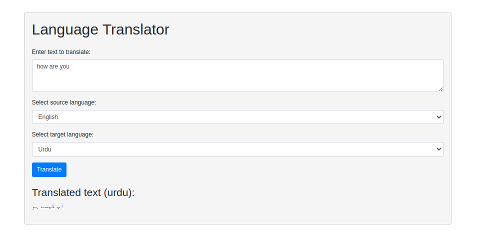

This program offers a web-based language translation service to the user. The user can input text in a specific language, select the source language, and choose a target language for translation. Upon submission, the program uses the Google Translate API to translate the input text from the source language to the target language. The translated text is then displayed on the webpage. The languages currently supported are English, Spanish, French, Hindi, German, Japanese, Urdu, and Arabic.

#huggingfacelink
https://huggingface.co/spaces/fahad56/translator
